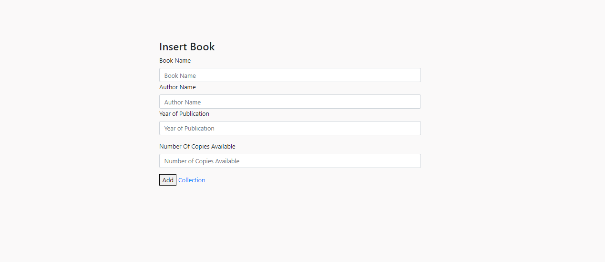
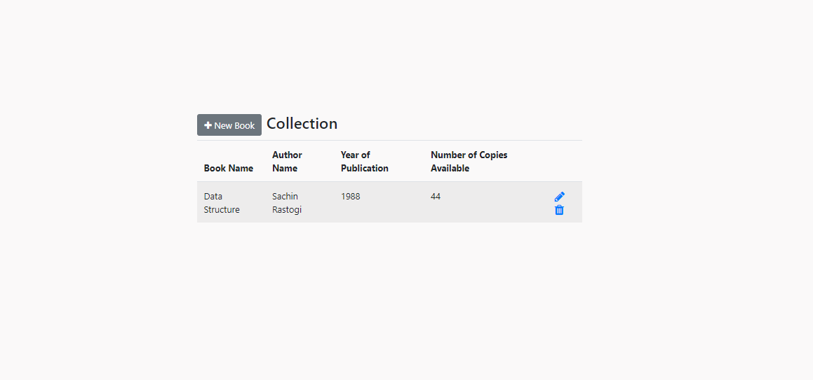

## KroopAI-Assignment
* pacakeges installed - created npm init to get .json file
* now install the following packages - express, mongoose, express handlebars, nodemon

### Create Database

* Database Name : bookDB
* Collection Name : books

### Make Connection

  Models->db.js
       

# How to start application

* Open MongoDB Compass in your system make connection to default port given by MongoDB -> mongodb://localhost:27017
* Open the files in VS Code or any code editor and give these two commands 
- npm i
- npm start

You will see a message "Express server started at port : 3000"
* so now open "http://localhost:3000" you will see 'Cannot GET /' i.e. everythings is completely fine

* now open "http://localhost:3000/book" here at this port you can add books as much as you want and press submit

* now you will redirected to "http://localhost:3000/book/list" where you can list all the book you want with author name, year, number of copies available & here you can delete, update or go back to previous page

* now you will redirected to "http://localhost:3000/book/list" where you can list all the book you want 
with author name, year, number of copies available & here you can delete, update or go back to previous page

